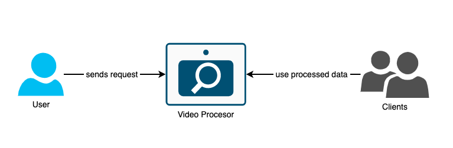
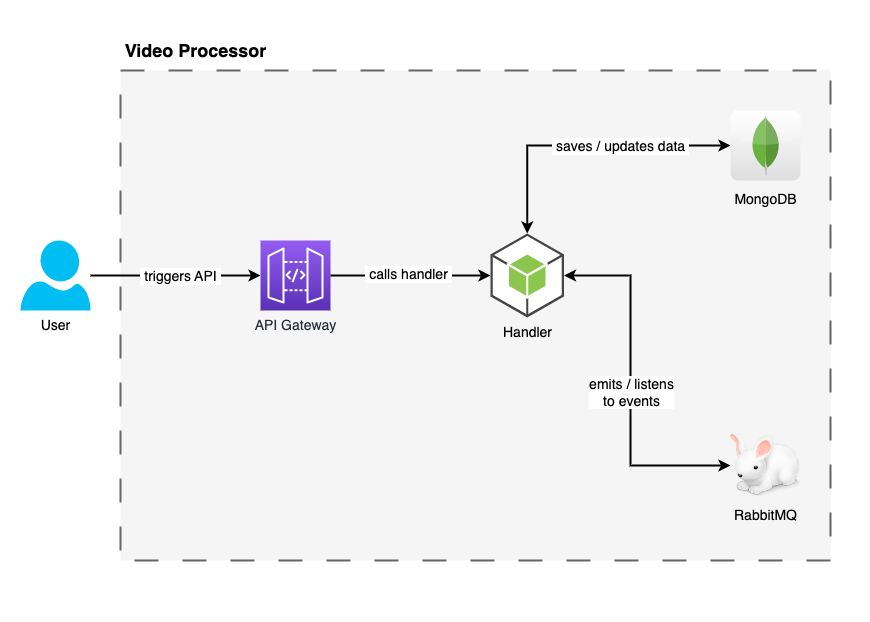
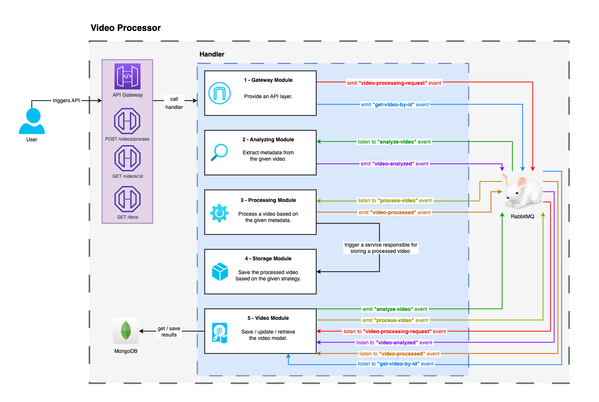

# video-processor <a id="top"></a>

A simple video project created to refresh skills in Nest.js, RabbitMQ, and MongoDB.

## Table of contents

- [Description](#description)
- [Usage](#usage)
- [Architecture](#architecture)
    - [C1 - Context](#context)
    - [C2 - Container](#container)
    - [C3 - Component](#component)
- [References](#references)

## Description <a id="description"></a>

This API should be able to perform a basic processing of a given video.
Firstly, all necessary metadata should be extracted from this video.
Then, some parameters used for processing should be generated and passed further.
Eventually, based on the metadata and transcoding parameters, video should be processed.
The results should be saved in a database.

<p align="right">(<a href="#top">back to top</a>)</p>

## Usage <a id="usage"></a>

Run the following script to start the application:

```
npm start
```

Here's a list of supported endpoints:

- #### POST _/videos/process_
- #### GET _/videos/:id_
- #### GET _/docs_

Tests can be run via the following script:

```
npm test
```

<p align="right">(<a href="#top">back to top</a>)</p>

## Architecture <a id="architecture"></a>

In order to better understand what's going on here, let's see a few diagrams and shed more light on the system.

### C1 - Context <a id="context"></a>

Generally speaking, the video processor should take a video, do the magic, and make it available to see the results.
Because it's based on asynchronous communication via queues, after the user sends a request to process a video,
he receives a quick response with generated video ID, so he's able to check the processing status later.



<p align="right">(<a href="#top">back to top</a>)</p>

### C2 - Container <a id="container"></a>

The only part of the system which is exposed to users is an API Gateway.
Because processing videos must be somehow triggerred, a simple HTTP endpoint was created for that,
but it can be easily replaced with another event.

After a handler is called, RabbitMQ topics are used to orchestrate its work.
Thanks to them, we are able to create a modular structure
(which is going to be described in the next section)
and react on some topic in order to save or update results in MongoDB.



<p align="right">(<a href="#top">back to top</a>)</p>

### C3 - Component <a id="component"></a>

The application consists of 3 major modules:

1. Analyzing Module
2. Processing Module
3. Storing Module

Let's briefly describe each of them.

#### Analyzing Module

This module starts the chain of operations performed to process the video.
It is responsible for extracting the metadata and sending it to the Processing Module
by sending a message on a right topic.

#### Processing Module

After the video analyzing is done, this module starts its work.
It transcodes a video using FFmpeg based on some example parameters.
Once its job is done, it is responsible for notifying the Storing Module that the results are ready.

#### Storing Module

The aim of this module is to encapsulate the logic connected with the database.
Thanks to it, we can easily replace the chosen database, and plug another one in seconds.
Also, if scaling the database was necessary, or if we wanted to migrate to microservices,
a dedicated module for database would be a great help with it!



<p align="right">(<a href="#top">back to top</a>)</p>

## References <a id="references"></a>

- All videos used for testing were taken from [this](https://gist.github.com/jsturgis/3b19447b304616f18657) gist.
- Postman collection for API can be found in the [docs](./docs) directory.
